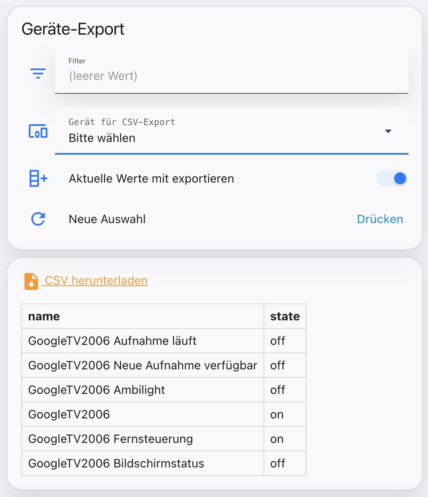

  

# DocBigsLab – Home Assistant Tools

Sammlung kleiner, eigenständiger Home-Assistant-Tools. Jedes Tool liegt in
seinem eigenen Unterordner mit eigenem README, eigener Installationsanleitung
und eigenen Dateien.

*entwickelt, nicht gebastelt*

## Tools

### 📄 [Geräte-CSV-Export](device-csv-export/)

Gerät per Dropdown im Dashboard auswählen und alle zugehörigen Entitäten als
CSV exportieren – wahlweise mit aktuellen Zuständen, inklusive Live-Vorschau
als Tabelle. Läuft komplett über pyscript, ohne Automation oder `notify:`.

→ [Zum Tool und zur Installationsanleitung](device-csv-export/)

---

*Weitere Tools folgen.*

## Lizenz

MIT, sofern im jeweiligen Unterordner nicht anders angegeben.
